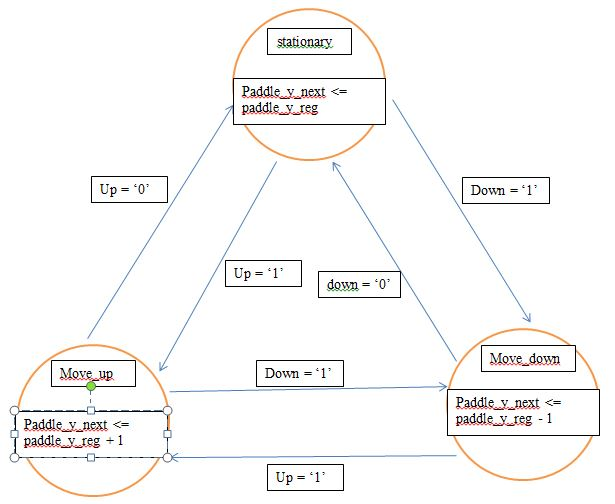
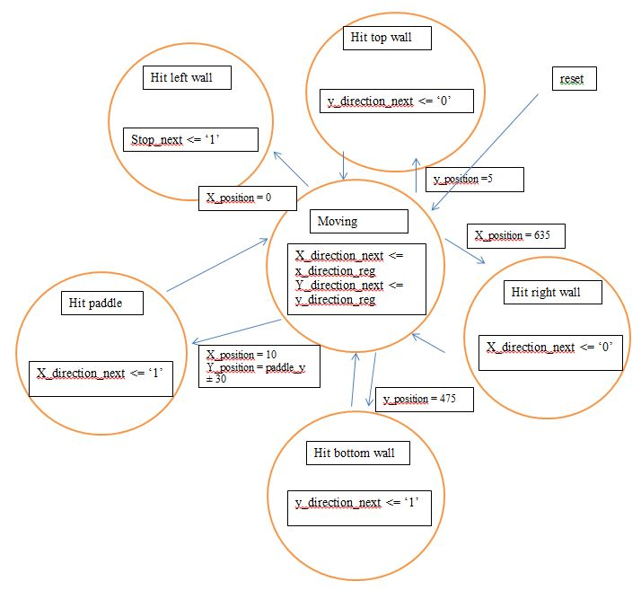
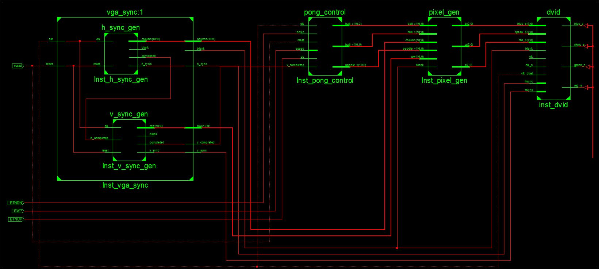

Lab 2
====

## Pong

### Introduction

The purpose of this lab was to create Pong by using the VGA driver from Lab 1 to display it on the screen and adding functionality for buttons to control the paddle. Required functionality was to simply get the game working which consists of an 'AF' logo in the background. The ball should disappear whenever it passes through the logo. B functionality involved implementing a switch to change the velocity of the ball. A functionality involved having the ball bounce off the paddle differently depending on where it hits the paddle. I used a Moore state machine for the ball as well as the paddle.

### Implementation

Similar constructs that were used in Lab 1 were used to create the Moore State Machines for the ball movement and paddle movement. 

#### Paddle Logic
The following constructs were used to create the paddle movement.

State register for paddle:
```VHDL
    process(reset, clk)
    begin			
		if(reset='1') then
			paddle_state_reg <= stationary;
		elsif(rising_edge(clk)) then
			paddle_state_reg <= paddle_state_next;
		end if;
	end process;
```

Next-state logic:
```VHDL
    process(paddle_state_reg, up, down)
    begin
	paddle_state_next <= paddle_state_reg;
	if(count_reg = 0) then
		case paddle_state_reg is
			when stationary =>
				if(up = '1') then
					paddle_state_next <= paddle_up;
				elsif(down = '1') then
					paddle_state_next <= paddle_down;
				end if;
			when paddle_up =>
				if(up = '0') then
					paddle_state_next <= stationary;
				elsif(down = '1') then
					paddle_state_next <= paddle_down;
				end if;
			when paddle_down =>
				if(down = '0') then
					paddle_state_next <= stationary;
				elsif(up = '1') then
					paddle_state_next <= paddle_up;
				end if;
			end case;
	end if;
	end process;
```

Look-ahead output logic:
```VHDL
    process(paddle_state_next, paddle_y_reg, count_reg, v_completed)
    begin
		paddle_y_next <= paddle_y_reg;
		if(count_reg = 0 and v_completed = '1') then
		case paddle_state_next is
			when stationary =>
			when paddle_up =>
				if(paddle_y_reg > 30) then
					paddle_y_next <= paddle_y_reg - to_unsigned(1,11);
				end if;
			when paddle_down =>
				if(paddle_y_reg <= 450) then
					paddle_y_next <= paddle_y_reg + to_unsigned(1,11);
				end if;
		end case;
		end if;
	end process;
```

Output buffer for the paddle:
```VHDL
    process(clk)
    begin
		if(rising_edge(clk)) then
			paddle_y_reg <= paddle_y_next;
		end if;
	end process;
```

The constructs above were used to realize in hardware the state-transition diagram for the paddle shown below.



#### Count and Velocity Logic

I also used a counter to count up to a certain number to slow the game down. Otherwise the ball and paddle would move as fast as the clock does which would make the game impossible. The count logic is below.

```VHDL
    count_next <=     (others => '0') when count_reg = velocity else
						count_reg + 1 when v_completed = '1' else
						count_reg;
```

Counter Register:
```VHDL
    process(clk, reset)
    begin
		if reset = '1' then
			count_reg <= (others => '0');
		elsif rising_edge(clk) then
			count_reg <= count_next;
		end if;
	end process;
```

It is important to note that the ```count_reg``` above counts to ```velocity``` which was determined using the logic below.

```VHDL
    velocity <= to_unsigned(FAST, 11) when speed = '1' else
    				to_unsigned(SLOW, 11);
```

```FAST``` and ```SLOW``` are constant integers set at the beginning of the program.

#### Ball Logic

The ball logic was split into three different parts. There is a process to change the state that the ball is in. Then there is a process to change the direction that the ball is travelling and then there is also the process to change the actuall position of the ball.

State register for the ball:
```VHDL
    process(reset, clk)
    begin			
		if(reset='1') then
			ball_state_reg <= moving;
		elsif(rising_edge(clk)) then
			ball_state_reg <= ball_state_next;
		end if;
	end process;
```

State register for the ball direction:
```VHDL
    process(clk, reset)
    begin
		if(reset = '1') then
			x_direction_reg <= '1';
			y_direction_reg <= '1';
			stop_reg <= '0';
		elsif(rising_edge(clk)) then
			x_direction_reg <= x_direction_next;
			y_direction_reg <= y_direction_next;
			stop_reg <= stop_next;
		end if;
	end process;
```

State register for the ball position:
```VHDL
    process(clk, reset)
    begin
		if(reset = '1') then
			ball_x_reg <= to_unsigned(320, 11);
			ball_y_reg <= to_unsigned(240, 11);
		elsif(rising_edge(clk)) then
			ball_x_reg <= ball_x_next;
			ball_y_reg <= ball_y_next;
		end if;
	end process;
```

Next state logic for the ball:
```VHDL
    process(ball_state_reg, ball_state_next, ball_x_reg, ball_y_reg, paddle_y_reg, count_reg)
    begin
	ball_state_next <= ball_state_reg;
	if(count_reg = 0) then
		case ball_state_reg is
			when moving =>
				if(ball_y_reg = to_unsigned(10, 11)) then
					ball_state_next <= hit_top_wall;
				elsif(ball_y_reg = to_unsigned(470, 11)) then
					ball_state_next <= hit_bottom_wall;
				elsif(ball_x_reg = to_unsigned(10, 11)) then
					ball_state_next <= hit_left_wall;
				elsif(ball_x_reg = to_unsigned(630, 11)) then
					ball_state_next <= hit_right_wall;
				end if;
				if(ball_x_reg = to_unsigned(13, 11)) then
					if((ball_y_reg >= paddle_y_reg - to_unsigned(30, 11)) and (ball_y_reg <= paddle_y_reg)) then
						ball_state_next <= hit_paddle_top;
					elsif((ball_y_reg <= paddle_y_reg + to_unsigned(30, 11)) and (ball_y_reg >= paddle_y_reg)) then
						ball_state_next <= hit_paddle_bottom;
					end if;
				end if;
			when hit_top_wall =>
				ball_state_next <= moving;
			when hit_right_wall =>
				ball_state_next <= moving;
			when hit_bottom_wall =>
				ball_state_next <= moving;
			when hit_paddle_top =>
				ball_state_next <= moving;
			when hit_paddle_bottom =>
				ball_state_next <= moving;
			when hit_left_wall =>
				ball_state_next <= moving;
			end case;
	end if;
	end process;
```

Output logic for the ball direction:
```VHDL
    process(ball_state_next, x_direction_reg, y_direction_reg, count_reg, stop_reg)
    begin
		y_direction_next <= y_direction_reg;
		x_direction_next <= x_direction_reg;
		stop_next <= stop_reg;
		if(count_reg = 0) then
			case ball_state_next is
				when hit_left_wall =>
					x_direction_next <= '1';
					stop_next <= '1';
				when moving =>
					y_direction_next <= y_direction_reg;
					x_direction_next <= x_direction_reg;
				when hit_top_wall =>
					y_direction_next <= '0';					
				when hit_right_wall =>
					x_direction_next <= '0';					
				when hit_bottom_wall => 
					y_direction_next <= '1';					
				when hit_paddle_top =>
					x_direction_next <= '1';
					y_direction_next <= '1';
				when hit_paddle_bottom =>
					x_direction_next <= '1';
					y_direction_next <= '0';
			end case;
		end if;
	end process;
```

Output logic for the ball position:
```VHDL
    process(count_reg, ball_x_reg, ball_y_reg, v_completed, stop_reg)
    begin
	ball_x_next <= ball_x_reg;
	ball_y_next <= ball_y_reg;
		if(count_reg = 0 and v_completed = '1' and stop_reg = '0') then
			if(x_direction_reg = '1') then
				ball_x_next <= ball_x_reg + 1;
			else
				ball_x_next <= ball_x_reg - 1;
			end if;
			if(y_direction_reg = '1') then
				ball_y_next <= ball_y_reg - 1;
			else
				ball_y_next <= ball_y_reg + 1;
			end if;
		end if;
	end process;
```

Outputs to ```pixel_gen.vhd``` that actually draw the position of the ball and the paddle.
```VHDL
    paddle_y <= paddle_y_reg;
    ball_x <= ball_x_reg;
	ball_y <= ball_y_reg;
```

The constructs above implemented in hardware the moore machine for the ball in the state transition diagram below.


The modules, each ```.vhd``` file, were connected as shown in the schematic below.


### Test/Debug

* Drawing the background and the paddle were relatively easy. Getting the paddle to move within the bounds of the screen was also relatively easy. The only problem I had with getting the paddle to move was a few syntax errors that were preventing it's position from updating.
* The majority of my time was spent trying to get the ball to move. Originally I was updating the position and the direction within the same process which proved to be detrimental to my success. When I would change a bounds condition for the ball hitting the left wall it would get stuck in some other part of the screen that should not have been effected by the miniscule change. After hours spent debugging this, I finally decided to split things up into different processes for the ball logic.
* Once I split things up for the ball logic, the coding was relatively straight forward. The main problem I had at this point was a ```x``` where a ```y``` was supposed to be. This took over an hour of frustration to find. Once I corrected this syntax error the ball moved fine and bounced off of everything like it was supposed to.
* B Functionality was straight forward.
* A Functionality allowed the ball to pass straight through the paddle on the first test. This was corrected with a ```<=``` sign instead of ```<``` to check where the position of the ball was at on the paddle.


### Conclusion

This lab took me way longer than expected because I was trying to do too many things inside of one process instead of splitting things up from the beginning. The lesson I learned here is that VHDL is super sensitive to trying to multiple things within one process at a time. From here on out, I will try to minimize what is going on inside of a process. 

### Documentation

C2C Tramaine Barnett helped me get the paddle moving because of a few syntax errors. I referenced C2C John Miller's code that he had posted on github when I was changing my ball logic from the singular process to multiple processes. 
